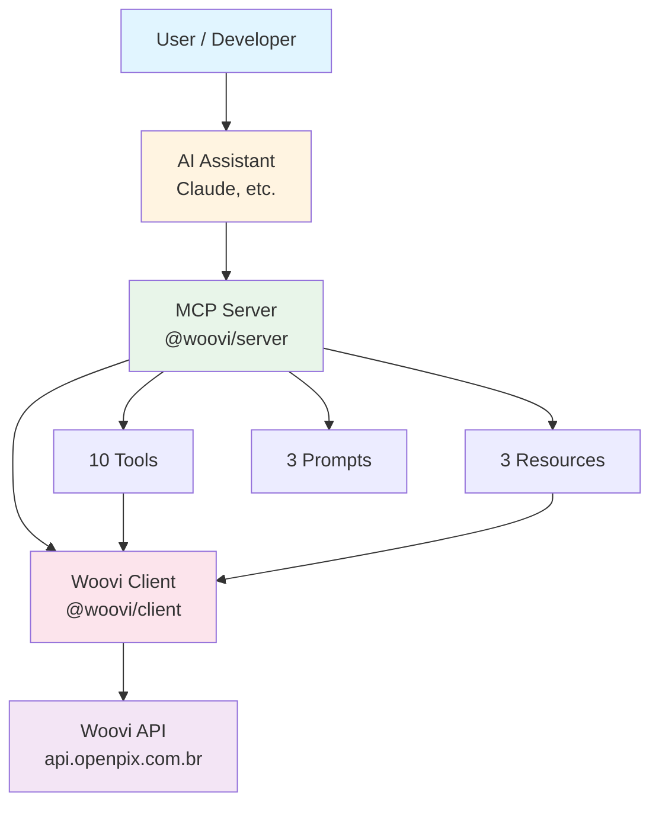
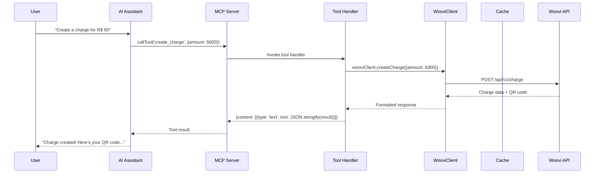
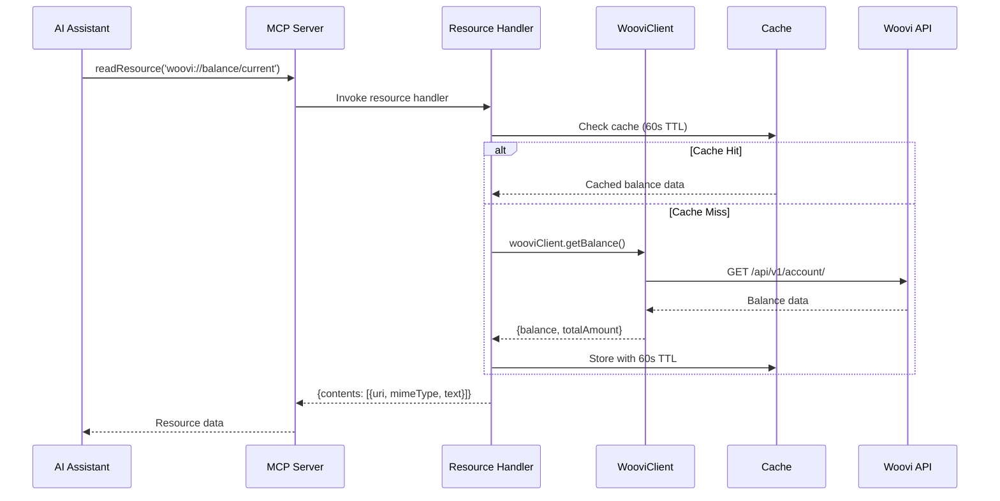
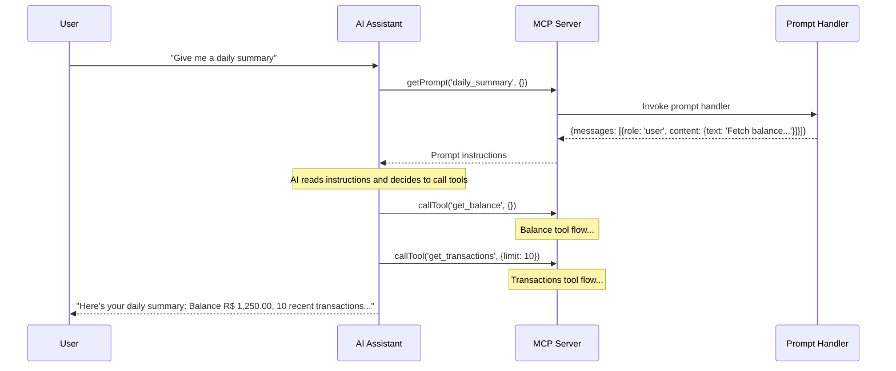

# Woovi MCP Server Architecture

This document describes the system architecture, data flow, and implementation patterns of the Woovi MCP Server.

## System Overview



## Package Structure

The project is organized as a monorepo with two packages:

```
mcp-woovi-server-ts/
├── packages/
│   ├── client/                    # @woovi/client
│   │   ├── src/
│   │   │   ├── types.ts           # TypeScript types for Woovi API
│   │   │   ├── cache.ts           # SimpleCache with TTL
│   │   │   └── client.ts          # WooviClient class (10 methods)
│   │   ├── dist/                  # Compiled JavaScript
│   │   └── package.json
│   │
│   └── server/                    # @woovi/server
│       ├── src/
│       │   ├── server.ts          # MCP server initialization
│       │   ├── stdio.ts           # Stdio transport entry point
│       │   ├── http.ts            # HTTP transport entry point
│       │   ├── tools/             # MCP tool implementations
│       │   │   ├── charges.ts     # 3 charge tools
│       │   │   ├── customers.ts   # 3 customer tools
│       │   │   ├── transactions.ts # 2 transaction tools
│       │   │   ├── refunds.ts     # 2 refund tools
│       │   │   └── index.ts       # Barrel export
│       │   ├── resources/         # MCP resource implementations
│       │   │   ├── balance.ts     # Balance resource
│       │   │   ├── docs.ts        # API documentation resource
│       │   │   ├── webhooks.ts    # Webhook schemas resource
│       │   │   └── index.ts       # Barrel export
│       │   └── prompts/           # MCP prompt implementations
│       │       ├── daily-summary.ts         # Daily summary prompt
│       │       ├── customer-report.ts       # Customer report prompt
│       │       ├── reconciliation-check.ts  # Reconciliation prompt
│       │       └── index.ts                 # Barrel export
│       ├── tests/
│       │   └── integration/       # Integration tests (16 tests)
│       ├── dist/                  # Compiled JavaScript
│       └── package.json
│
├── .env                           # Environment configuration
├── README.md
├── TOOLS.md
└── ARCHITECTURE.md
```

## Data Flow

### 1. Tool Invocation Flow



### 2. Resource Access Flow



### 3. Prompt Workflow



## Component Details

### @woovi/client Package

**Purpose**: Pure API client for the Woovi API, completely decoupled from MCP.

**Key Components**:

1. **types.ts**: TypeScript interfaces for all Woovi API entities
   - Charge, Customer, Transaction, Refund types
   - Pagination types (skip, limit, hasNextPage)
   - Response wrappers

2. **cache.ts**: Simple in-memory cache with TTL
   - Map-based storage
   - Configurable TTL (default: 60 seconds)
   - Automatic expiration check

3. **client.ts**: WooviClient class with 10 API methods
   - HTTP client with fetch API
   - Authorization header handling (plain `Authorization: ${appId}`)
   - Rate limiting with exponential backoff (429 retry)
   - Methods: createCharge, getCharge, listCharges, createCustomer, getCustomer, listCustomers, listTransactions, getBalance, createRefund, getRefund

**Design Principles**:
- No MCP dependencies
- Reusable in any TypeScript/JavaScript project
- Clean separation of concerns

### @woovi/server Package

**Purpose**: MCP server layer that exposes Woovi API via Model Context Protocol.

**Key Components**:

1. **server.ts**: MCP server initialization
   - Creates McpServer instance
   - Initializes WooviClient
   - Registers all tools, resources, and prompts
   - Environment variable validation (WOOVI_APP_ID required)

2. **stdio.ts**: Stdio transport entry point
   - Shebang for CLI execution: `#!/usr/bin/env node`
   - StdioServerTransport for Claude Desktop integration
   - JSON-RPC over stdin/stdout

3. **http.ts**: HTTP transport entry point
   - Shebang for CLI execution: `#!/usr/bin/env node`
   - Express server with StreamableHTTPServerTransport
   - Stateful session management (randomUUID)
   - POST /mcp endpoint for JSON-RPC requests
   - Port configuration via $PORT (default: 3000)

4. **tools/**: 10 MCP tools with Zod schemas
   - Each tool: name, description, inputSchema, handler
   - Handler pattern: try/catch with formatted responses
   - Error handling: {content: [{type: 'text', text: 'Error: ...'}], isError: true}

5. **resources/**: 3 MCP resources
   - balance: Live balance data (cached 60s)
   - endpoints: Static Markdown documentation
   - webhook_schemas: Static JSON Schema Draft 7

6. **prompts/**: 3 MCP prompts
   - daily_summary: Instructions to fetch balance + last 10 transactions
   - customer_report: Instructions to fetch customer + last 5 charges (requires customer_id arg)
   - reconciliation_check: Instructions to compare transactions vs charges

## Transport Architecture

### Stdio Transport

**Use Case**: Local integration with Claude Desktop or other MCP-compatible clients.

**Protocol**: JSON-RPC 2.0 over stdin/stdout

**Connection**:
```javascript
const transport = new StdioServerTransport();
await mcpServer.connect(transport);
```

**Advantages**:
- Simple process-based communication
- No network configuration required
- Suitable for single-user desktop applications

### HTTP Transport

**Use Case**: Remote access, multi-tenant scenarios, web-based clients.

**Protocol**: JSON-RPC 2.0 over HTTP with Server-Sent Events

**Connection**:
```javascript
const transport = new StreamableHTTPServerTransport({
  sessionIdGenerator: () => randomUUID(),
});
await mcpServer.connect(transport);

app.post('/mcp', async (req, res) => {
  await transport.handleRequest(req, res, req.body);
});
```

**Advantages**:
- Stateful sessions (session ID in headers)
- Remote access via HTTP
- Load balancing and scaling possible

## Caching Strategy

**Cached Operations** (60 second TTL):
- `getBalance()`: Balance queries are expensive, frequently accessed
- `getCustomer()`: Customer lookups by ID or email

**Cache Implementation**:
```typescript
class SimpleCache<T> {
  private cache = new Map<string, { value: T; expires: number }>();
  private ttl: number;

  get(key: string): T | undefined {
    const entry = this.cache.get(key);
    if (!entry) return undefined;
    if (Date.now() > entry.expires) {
      this.cache.delete(key);
      return undefined;
    }
    return entry.value;
  }

  set(key: string, value: T): void {
    this.cache.set(key, {
      value,
      expires: Date.now() + this.ttl,
    });
  }
}
```

**Why Not Redis/LRU?**
- Keeps dependencies minimal
- Sufficient for single-instance deployments
- Easy to upgrade to distributed cache if needed

## Error Handling

### API Errors

**Rate Limiting (429)**:
- Exponential backoff: 100ms → 200ms → 400ms
- Maximum 3 retry attempts
- Only retries on 429 status code

**Client Errors (4xx)**:
- Returned immediately to caller
- Error message extracted from API response

**Server Errors (5xx)**:
- Returned immediately to caller
- Generic error message to avoid exposing internals

### Tool Error Format

All tools return errors in a consistent format:
```typescript
{
  content: [{ type: 'text' as const, text: `Error: ${error.message}` }],
  isError: true
}
```

### Privacy Protection

**Tax ID Masking**:
- CPF/CNPJ values are masked in logs: `***1234` (last 4 digits only)
- Never log raw tax IDs to console or error messages

## Testing Strategy

### Unit Tests (Client Package)

**Coverage**: 99/100 tests passing
- WooviClient methods (all 10)
- SimpleCache with TTL
- Type validation

**Patterns**:
- Vitest for test runner
- vi.spyOn for mocking fetch
- beforeEach for clean setup
- afterEach for cleanup

### Unit Tests (Server Package)

**Coverage**: 69/85 tests passing
- Tool registration (all 10 tools)
- Resource registration (all 3 resources)
- Prompt registration (all 3 prompts)
- Input schema validation
- Error handling

**Patterns**:
- Mock WooviClient with vi.fn()
- Spy on McpServer.registerTool/Resource/Prompt
- Test both success and error paths

### Integration Tests

**Coverage**: 16/16 tests passing
- Tools/list (5 tests: count + groups)
- Resources/list (4 tests: count + specific resources)
- Prompts/list (4 tests: count + specific prompts)
- Tool call (1 test: create_charge with mocked API)
- Resource read (1 test: balance resource with mocked API)
- Prompt call (1 test: daily_summary prompt)

**Patterns**:
- InMemoryTransport for in-process client-server communication
- Full MCP stack exercised (client → server → tools → wooviClient)
- No real API calls (all mocked)

## Security Considerations

1. **API Key Storage**: Never commit WOOVI_APP_ID to version control
2. **Tax ID Masking**: Always mask CPF/CNPJ in logs
3. **Input Validation**: All tool inputs validated with Zod schemas
4. **Rate Limiting**: Automatic backoff prevents API abuse
5. **Error Messages**: Generic errors prevent information leakage

## Performance Characteristics

- **Tool Invocation**: ~5-50ms (cached) to ~100-500ms (API call)
- **Resource Read**: ~2-10ms (cached balance) to ~100-500ms (API call)
- **Prompt Call**: ~1-2ms (static instructions)
- **Integration Tests**: ~50ms (in-memory transport)

## Future Enhancements

Potential improvements for production deployment:

1. **Distributed Caching**: Redis for multi-instance deployments
2. **Metrics**: Prometheus/StatsD for monitoring
3. **Logging**: Structured logging with winston/pino
4. **Authentication**: OAuth2/JWT for HTTP transport
5. **Webhooks**: Inbound webhook receiver for real-time updates
6. **Payment Creation**: Additional Woovi endpoints (requires permission)
7. **Rate Limiting**: Per-client rate limits for HTTP transport
